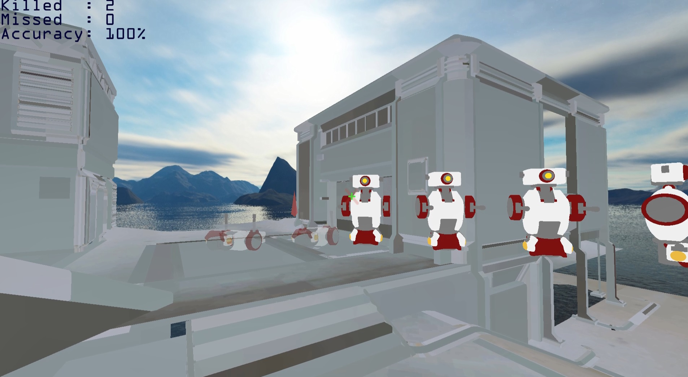

# OpenGL FPS Training
### Preview

### Demo

### How to run (Windows)
* Download zip [here](https://github.com/esc5221/OpenGL_FPS-Training/releases/tag/1.0.0)
* unzip, run OpenGL_FPS-Training.exe

### Implementation
* Object loading
* Bullet collision detection (using Ray-OBB intersection)

### Functions
* Shootiing(Left mouse button), Moving(WASD), Jumping(Space)
* Press key 1 to toggle hitbox display mode.

### Features
* When bullet hit a bot, eliminate the bot.
* Eliminated bots are respawned after 3 seconds.
* Displaying bullet trajectory.
* Displaying crosshair.
* Displaying hit marker when bullet hit a bot.
* Displaying scores (Killed, Missed, Accuracy).

### References
* [1] https://github.com/opengl-tutorials/ogl/tree/master/misc05_picking (picking algorithm)
* [2] https://www.tinkercad.com/things/3juCNLmkQXm-overwatch-training-bot (training bot .obj file)